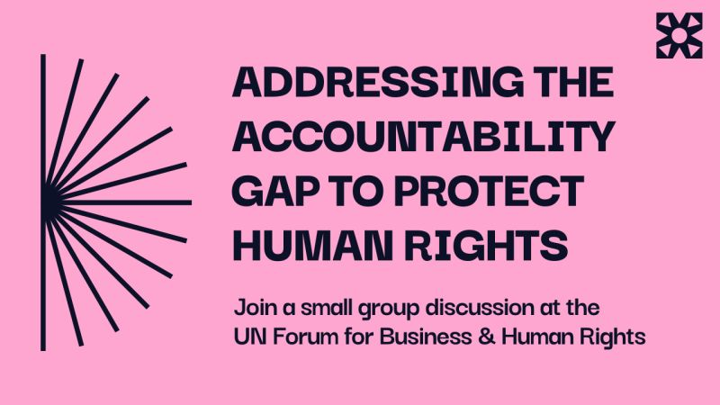

# Attending the United Nations Forum on Business and Human Rights in ...

**Date:** 2025-11-11

**Impressions:** 0 | **Reactions:** 24 | **Comments:** 0 | **Reposts:** 8

**LinkedIn URL:** [View Post](https://www.linkedin.com/feed/update/urn:li:activity:7394110933008216065)

---

Attending the United Nations Forum on Business and Human Rights in Geneva later this month? So are we!

Join our Director of Stakeholder Engagement, Hannah Lennett, alongside Aureliane Frohlich and Vasiliki Gkatziaki of Wikirate, Paul Roeland of Clean Clothes Campaign, and Moin Khan of Supply Trace for a small group discussion about a critical but often-overlooked step in human rights due diligence: having transparent and accessible supply chain data. Without it, we risk a lack of accountability, inequitable stakeholder participation, and piecemeal, disconnected progress.

If you are attending the forum, we invite you to join us for a series of dedicated, small-group discussions to identify and contribute to broader solutions for creating transparent supply chains that are truly meaningful. 

Your voice is essential. Whether you manage risk, fund change, legislate policy, or advocate on the ground, your perspective is necessary to defining the collective path toward meaningful supply chain transparency.

Register for a discussion: https://lnkd.in/ezK9QzGT

Or if you’d like to set up a 1:1 meeting with Open Supply Hub to explore potential collaborations, integrations or programs using open supply chain data to advance human rights, feel free to reach out: https://lnkd.in/g6ha_Z_D

#UNForumBHR 
#UNForum2025 
#BusinessAndHumanRights 
#HumanRightsDueDiligence 
#supplychaintransparency

