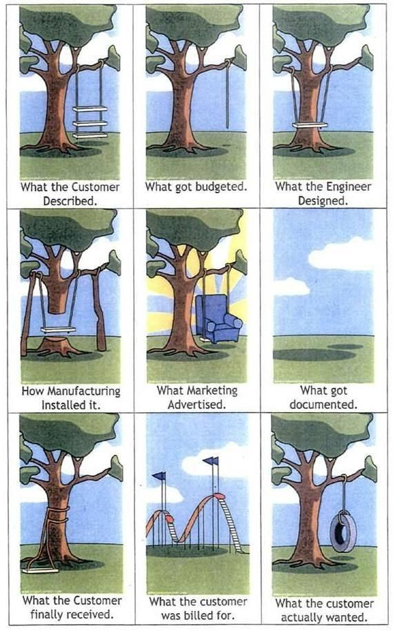

# Imagine you’re building Burj Khalifa out of Hego🧱

**Date:** 2025-12-04

**Impressions:** 21,205 | **Reactions:** 24 | **Comments:** 5 | **Reposts:** 1

**LinkedIn URL:** [View Post](https://www.linkedin.com/feed/update/urn:li:activity:7402388577843605504)

---

Imagine you’re building 𝗕𝘂𝗿𝗷 𝗞𝗵𝗮𝗹𝗶𝗳𝗮 𝗼𝘂𝘁 𝗼𝗳 𝗛𝗲𝗴𝗼🧱
A seriously complicated thing — 163 floors.

You make this beautiful blueprint, give it to your team:
"Here’s the blueprint, here’s the building I want — take your Lego, build it."
They start building.

Half a year later. They reached floor 13 out of 163.
And you’re like:
"Oh, I need to tear down these walls on the 2nd and 5th floor. 
We need shops here.
I made deals with tenants." 🏪
It’s Lego, not concrete — why not be flexible?

Your beautiful blueprint? Forget it.
You need to earn money now, or you die 150 times over by the time you finish building.
Picture the sour faces of people who just got a new blueprint — and they haven’t even finished the previous one 😬

You change the blueprint, but it doesn’t affect anything.
They’re still building the old one.
And even when they do follow it, they don’t check every detail.
"This piece doesn’t fit, this breaks physics."
There’s already a gap. 
The blueprint lives its own life. 
The building lives its own life.
At some point, you’re just like: 
“Screw it, act from what you have on a plate, not on paper.”

Yes, this analogy is a bit of a stretch.
But this is exactly what happens with software development 💻

For decades, the idea was: 𝗿𝗲𝗾𝘂𝗶𝗿𝗲𝗺𝗲𝗻𝘁𝘀-𝗳𝗶𝗿𝘀𝘁.
DDD/BDD say: describe the domain, then behaviour, then dance around that.
 Beautiful idea. Except — you can change documentation, but rewriting half the project?
𝘎𝘰𝘰𝘥 𝘭𝘶𝘤𝘬 𝘸𝘪𝘵𝘩 𝘵𝘩𝘢𝘵.

It doesn’t matter what’s written in Jira —
it matters what’s inside the “src/” folder.
You end up dancing around what’s already built — not around what was documented.
That’s why we invented Scrum: short plans, quick increments, build in small steps, from working to working.
Everything to make 𝗰𝗼𝗱𝗲 𝘁𝗵𝗲 𝘀𝗼𝘂𝗿𝗰𝗲 𝗼𝗳 𝘁𝗿𝘂𝘁𝗵.
____

Now, AI 🤖.
Imagine instead of workers, you have a 3D printer.
You draw the blueprint — it prints the building in a month.
You change the blueprint — it reprints.
A month, not a year.
Would it change anything?

Same with code now.
You introduce a user story to Jira — AI catches it and generates code.
You change it — AI regenerates.
Now the code catches up to the paper, not the other way around.
What DDD dreamed of — now actually looks possible.

I’m not saying it’s 100% there yet.
But look at the trajectory:
On SWE-Bench — a benchmark using real GitHub issues — top models now resolve 60%+ cases (vs 23% a year ago).
New frameworks like BMAD appear.
Amazon releases Kiro (a requirements-first IDE).

Think about what this means 🧠
Development used to be the longest stage.
Now people can push their ideas further and start selling faster.

If requirements become the main thing —
𝘄𝗲 𝘀𝗵𝗼𝘂𝗹𝗱 𝗯𝗲 𝘀𝘁𝗼𝗿𝗶𝗻𝗴 𝗽𝗿𝗼𝗺𝗽𝘁𝘀, 𝗻𝗼𝘁 𝗰𝗼𝗱𝗲.

The skill of changing the blueprint becomes more valuable than the skill of laying bricks.
Not because we’re better at documentation —
but because 𝗿𝗲𝗯𝘂𝗶𝗹𝗱𝗶𝗻𝗴 𝗴𝗼𝘁 𝗰𝗵𝗲𝗮𝗽.

