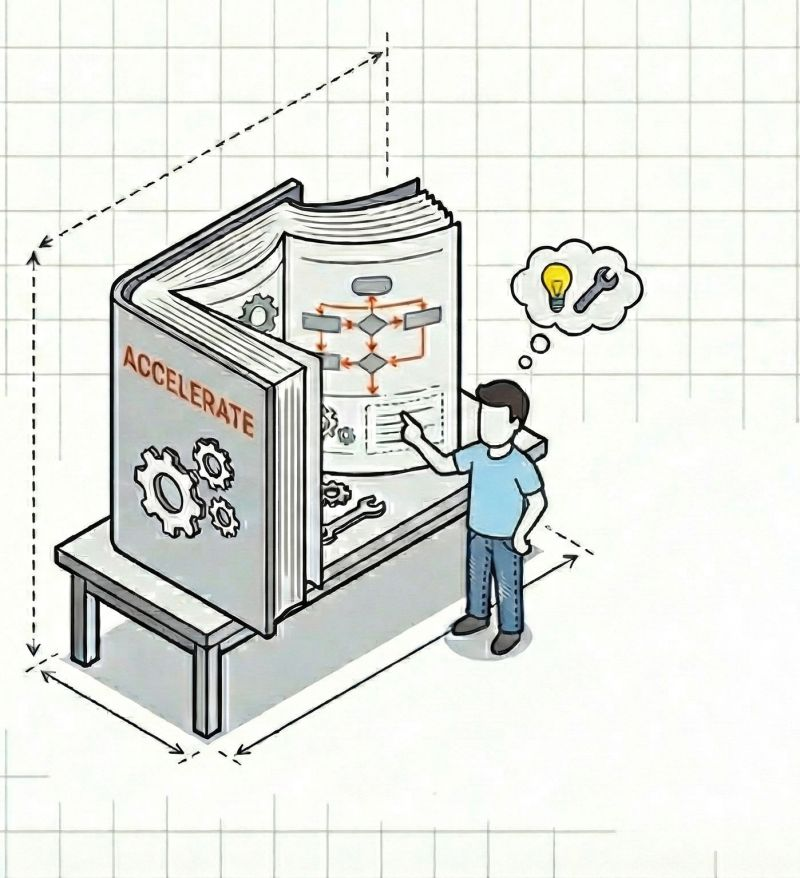

# An engineering book taught me management.

**Date:** 2025-12-09

**Impressions:** 473 | **Reactions:** 7 | **Comments:** 1 | **Reposts:** 0

**LinkedIn URL:** [View Post](https://www.linkedin.com/feed/update/urn:li:activity:7404153601205473280)

---

An engineering book taught me management.

Sounds weird, but "𝗔𝗰𝗰𝗲𝗹𝗲𝗿𝗮𝘁𝗲: 𝗧𝗵𝗲 𝗦𝗰𝗶𝗲𝗻𝗰𝗲 𝗼𝗳 𝗛𝗲𝗮𝗻 𝗦𝗼𝗳𝘁𝘄𝗮𝗿𝗲 𝗮𝗻𝗱 𝗗𝗲𝘃𝗢𝗽𝘀" by Nicole Forsgren, Jez Humble, Gene Kim isn’t really about code. 
It’s about the fact that 𝘺𝘰𝘶 𝘤𝘢𝘯'𝘵 𝘮𝘢𝘯𝘢𝘨𝘦 𝘸𝘩𝘢𝘵 𝘺𝘰𝘶 𝘥𝘰𝘯'𝘵 𝘮𝘦𝘢𝘴𝘶𝘳𝘦.

This book systematized everything and finally pushed me to make the shift from engineer to manager. It changed how I see the product itself.

Your product is alive. 
You work on it, you break things.
The only question is how reasonable those breaks are. 
And the book gives you a way to measure exactly that.

It introduces some key metrics: 𝗱𝗲𝗽𝗹𝗼𝘆𝗺𝗲𝗻𝘁 𝗳𝗿𝗲𝗾𝘂𝗲𝗻𝗰𝘆, 𝗹𝗲𝗮𝗱 𝘁𝗶𝗺𝗲 𝗳𝗼𝗿 𝗰𝗵𝗮𝗻𝗴𝗲𝘀, 𝗰𝗵𝗮𝗻𝗴𝗲 𝗳𝗮𝗶𝗹𝘂𝗿𝗲 𝗿𝗮𝘁𝗲, 𝗮𝗻𝗱 𝗺𝗲𝗮𝗻 𝘁𝗶𝗺𝗲 𝘁𝗼 𝗿𝗲𝘀𝘁𝗼𝗿𝗲.
They look like technical metrics. 
But actually, they’re a 𝗺𝗶𝗿𝗿𝗼𝗿 𝗼𝗳 𝘆𝗼𝘂𝗿 𝗯𝘂𝘀𝗶𝗻𝗲𝘀𝘀.

And here’s where it gets interesting: 
when you measure, you automatically start looking wider than "I write code." You see the whole journey: 
from opening VS Code to the moment your code actually changes something for the user.

You start to realize that uptime is 𝘤𝘢𝘳𝘪𝘯𝘨 𝘢𝘣𝘰𝘶𝘵 𝘶𝘴𝘦𝘳𝘴. 
And that caring transforms into value. 
And into money. And ultimately, into your income 😀💰

𝗖𝗼𝗱𝗲 𝗶𝘀 𝗮 𝘀𝗺𝗮𝗹𝗹 𝗽𝗮𝗿𝘁 𝗼𝗳 𝗮 𝗽𝗿𝗼𝗱𝘂𝗰𝘁’𝘀 𝘀𝘂𝗰𝗰𝗲𝘀𝘀 𝘀𝘁𝗼𝗿𝘆. 
This book shows that beyond code there’s a whole kingdom — one that engineers influence heavily, often without even realizing it.

You become valuable when you have a 𝗺𝗶𝘅 𝗼𝗳 𝘁𝗵𝗶𝗻𝗸𝗶𝗻𝗴. 
When you see both the code and the business. 
When you understand that your work doesn’t end with the pull request.

If you’re thinking about building your own tech business, if you want to become a CTO — 𝘵𝘩𝘪𝘴 𝘬𝘪𝘯𝘥 𝘰𝘧 𝘷𝘪𝘴𝘪𝘰𝘯 is what gets you there.

