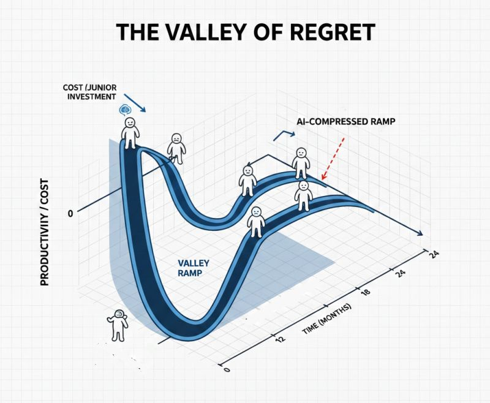

# Most juniors leave before becoming useful. AI might cut that window...

**Date:** 2026-01-27

**Impressions:** 7,943 | **Reactions:** 9 | **Comments:** 4 | **Reposts:** 1

**LinkedIn URL:** [View Post](https://www.linkedin.com/feed/update/urn:li:activity:7421897520596893696)

---

𝗠𝗼𝘀𝘁 𝗷𝘂𝗻𝗶𝗼𝗿𝘀 𝗹𝗲𝗮𝘃𝗲 𝗯𝗲𝗳𝗼𝗿𝗲 𝗯𝗲𝗰𝗼𝗺𝗶𝗻𝗴 𝘂𝘀𝗲𝗳𝘂𝗹. 𝗔𝗜 𝗺𝗶𝗴𝗵𝘁 𝗰𝘂𝘁 𝘁𝗵𝗮𝘁 𝘄𝗶𝗻𝗱𝗼𝘄 𝗶𝗻 𝗵𝗮𝗹𝗳.

I came across Kent Beck’s article about juniors in the AI era.
His main thesis: manage juniors for learning, not production.

Beck frames it as the “𝘃𝗮𝗹𝗹𝗲𝘆 𝗼𝗳 𝗿𝗲𝗴𝗿𝗲𝘁” — his take on the classic startup "valley of death," but applied to junior investment. It’s the period when you’re spending money and senior attention on a junior, but getting no return yet. The longer the valley, the higher the chance something goes wrong: the junior leaves, the startup runs out of runway, layoffs happen.

AI shrinks this valley — not because it does the work for the junior, but because it 𝗰𝗼𝗹𝗹𝗮𝗽𝘀𝗲𝘀 𝘁𝗵𝗲 𝘀𝗲𝗮𝗿𝗰𝗵 𝘀𝗽𝗮𝗰𝗲. Instead of three hours figuring out which API to use, twenty minutes evaluating options AI already surfaced.

𝗧𝗵𝗲 𝘀𝘂𝗿𝘃𝗶𝘃𝗮𝗹 𝗺𝗮𝘁𝗵 𝗮𝘁 𝟮𝟰% 𝗮𝗻𝗻𝘂𝗮𝗹 𝗮𝘁𝘁𝗿𝗶𝘁𝗶𝗼𝗻:
→ Traditional 24-month ramp: 𝟱𝟲% leave before becoming net positive 
→ Compressed 9-month ramp: only 𝟱𝟱%
Shorter valley means more bets pay off. 📉

I’ve written before that the fear of juniors disappearing is overblown. A year ago, a junior needed to learn React. Now, a junior needs to learn Claude Code — and that’s basically the whole revolution.

Beck warns this won’t happen by itself. You need to intentionally teach 𝗮𝘂𝗴𝗺𝗲𝗻𝘁𝗲𝗱 𝗰𝗼𝗱𝗶𝗻𝗴 — not vibe coding, where you accept whatever AI spits out, but deliberate work with the tool. 💡

Agreed. If juniors enter actual symbiosis with AI, that means exponential productivity — not because they prompt better, but because they think through the tool. 🚀

What’s your experience — does AI actually speed up junior onboarding?

Thanks to Kent Beck for a thought-provoking piece. Link in comments.

