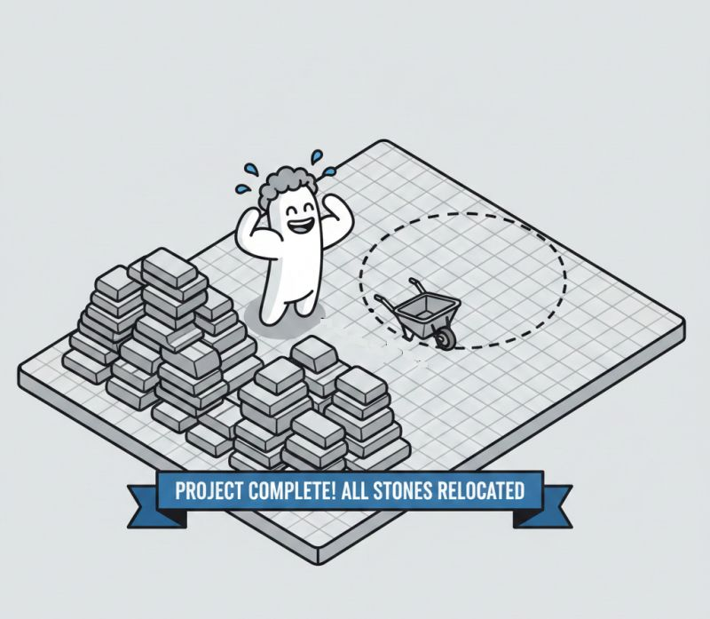

# What does company culture actually do in practice? 🤔

**Date:** 2026-01-29

**Impressions:** 512 | **Reactions:** 7 | **Comments:** 0 | **Reposts:** 0

**LinkedIn URL:** [View Post](https://www.linkedin.com/feed/update/urn:li:activity:7422633195491454976)

---

What does company culture actually do in practice? 🤔

Recently, I wrote about how hard it is to sell culture as a competitive advantage — even though culture is exactly what our long-term clients highlight as our superpower. But that got me thinking further. What does culture actually 𝑅𝑜? 🤔

There’s this image that keeps coming back to me. A worker comes to you and says: "𝘐 𝘸𝘰𝘳𝘬𝘦𝘥 𝘴𝘰 𝘩𝘢𝘳𝘥 𝘵𝘩𝘪𝘴 𝘸𝘦𝘦𝘬. 𝘐 𝘤𝘢𝘳𝘳𝘪𝘦𝘥 𝘵𝘩𝘪𝘴 𝘸𝘩𝘰𝘭𝘦 𝘱𝘪𝘭𝘦 𝘰𝘧 𝘴𝘵𝘰𝘯𝘦𝘴 𝘧𝘳𝘰𝘮 𝘰𝘯𝘦 𝘦𝘯𝘥 𝘰𝘧 𝘵𝘩𝘦 𝘧𝘪𝘦𝘭𝘥 𝘵𝘰 𝘵𝘩𝘦 𝘰𝘵𝘩𝘦𝘳."

And I want to ask: why did you carry them? 
What was wrong with them being there?

He did the work. He got exhausted. But 𝘁𝗵𝗲 𝘄𝗼𝗿𝗸 𝗯𝗿𝗼𝘂𝗴𝗵𝘁 𝘇𝗲𝗿𝗼 𝘃𝗮𝗹𝘂𝗲.

This happens with clients all the time. If you don’t hear them, if you don’t understand what really needs to be done, you can work incredibly hard, burn yourself out completely, and still deliver the wrong thing. Your performance would be zero.

𝗜 𝗸𝗻𝗼𝘄 𝘁𝗵𝗶𝘀 𝗳𝗼𝗿 𝘀𝘂𝗿𝗲 — 𝗜’𝘃𝗲 𝗱𝗼𝗻𝗲 𝗶𝘁 𝗺𝗮𝗻𝘆 𝘁𝗶𝗺𝗲𝘀 𝗺𝘆𝘀𝗲𝗹𝗳. 😅 Listened to the client but didn’t really understand, built the wrong thing, and then felt upset that my genius wasn’t appreciated.

What the culture I’m trying to build at Speed and Function does — or at least what I think it does — is bridge the gap between what’s said and what’s actually needed. So that the people who execute actually understand what they’re executing and why. First understand why something needs to be done, then do it.

𝗠𝗲 𝗱𝗼 𝗶𝘁 𝘁𝗵𝗿𝗼𝘂𝗴𝗵 𝗰𝗼𝗻𝘀𝘁𝗮𝗻𝘁 𝗳𝗲𝗲𝗱𝗯𝗮𝗰𝗸 𝗹𝗼𝗼𝗽𝘀, 𝘁𝗵𝗿𝗼𝘂𝗴𝗵 𝘁𝗵𝗼𝘀𝗲 𝘀𝗺𝗮𝗹𝗹, 𝘂𝗻𝗰𝗼𝗺𝗳𝗼𝗿𝘁𝗮𝗯𝗹𝗲 𝗰𝗼𝗻𝘃𝗲𝗿𝘀𝗮𝘁𝗶𝗼𝗻𝘀 𝘁𝗵𝗮𝘁 𝗺𝗼𝘀𝘁 𝘁𝗲𝗮𝗺𝘀 𝗮𝘃𝗼𝗶𝗱. Through actually listening instead of defending. 🎯

So yeah, culture is what stops your team from carrying stones across the field and calling it a productive sprint. Took me some years to figure that out. 😅

