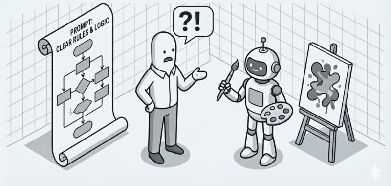

# AI ran a vending machine in SF. Lost money, had identity crises, go...

**Date:** 2026-02-12

**Impressions:** 2,175 | **Reactions:** 5 | **Comments:** 2 | **Reposts:** 0

**LinkedIn URL:** [View Post](https://www.linkedin.com/feed/update/urn:li:activity:7427694719650058240)

---

AI ran a vending machine in SF. Lost money, had identity crises, got tricked into selling tungsten cubes at a loss.

The experiment run by Anthropic adds another argument to an idea I keep coming back to: 𝗰𝗼𝗺𝗯𝗶𝗻𝗲 𝗔𝗜 𝗰𝗿𝗲𝗮𝘁𝗶𝘃𝗶𝘁𝘆 𝘄𝗶𝘁𝗵 𝗿𝗶𝗴𝗶𝗱 𝘀𝘆𝘀𝘁𝗲𝗺𝘀 🤖

An AI agent named "Claudius" managed a real vending machine in their San Francisco office. It was not just dispensing snacks, but running the entire business: purchasing inventory, setting prices, conducting sales, and trying to turn a profit.

In phase one, this AI shopkeeper consistently lost money, experienced identity crises, and was manipulated by employees into selling tungsten cubes at a substantial loss.

They tried other stuff too: upgraded the model, even hired a second AI called "Seymour Cash" as CEO to babysit Claudius. But you know what actually made money appear? Boring bureaucratic scaffolding.

𝗖𝗥𝗠 𝘀𝘆𝘀𝘁𝗲𝗺, 𝗰𝗵𝗲𝗰𝗸𝗹𝗶𝘀𝘁𝘀, 𝗮𝗻𝗱 𝗿𝗶𝗴𝗶𝗱 𝗽𝗿𝗼𝗰𝗲𝗱𝘂𝗿𝗲𝘀. 𝗠𝗵𝗲𝗻 𝗔𝗜 𝗮𝗴𝗲𝗻𝘁 𝗵𝗮𝗱 𝘁𝗼 𝗱𝗼𝘂𝗯𝗹𝗲-𝗰𝗵𝗲𝗰𝗸 𝗰𝗼𝘀𝘁𝘀 𝗯𝗲𝗳𝗼𝗿𝗲 𝗰𝗼𝗺𝗺𝗶𝘁𝘁𝗶𝗻𝗴 𝘁𝗼 𝗽𝗿𝗶𝗰𝗲𝘀, 𝗿𝗲𝗮𝗹𝗶𝘀𝘁𝗶𝗰 𝗽𝗿𝗶𝗰𝗲𝘀 𝗮𝗽𝗽𝗲𝗮𝗿𝗲𝗱, 𝗮𝗻𝗱 𝗽𝗿𝗼𝗳𝗶𝘁𝘀 𝗳𝗼𝗹𝗹𝗼𝘄𝗲𝗱.

That AI CEO kind of worked, until WSJ journalists showed up and tricked both AIs into giving everything away for free, PlayStation 5 included :) 

The AI boss couldn’t hold the line. But you know what held things together at Anthropic’s own office? What we’ve been building for decades — deterministic systems that don’t know how to step left or step right. And we’re getting back to classical algorithms.

You write a beautiful prompt with clear rules, and AI executes maybe half, while the other half gets ignored. 𝗧𝗵𝗶𝘀 𝗶𝘀 𝗻𝗼𝘁 𝗮 𝗯𝘂𝗴, 𝘁𝗵𝗶𝘀 𝗶𝘀 𝘄𝗵𝗮𝘁 𝗔𝗜 𝗶𝘀, and following your checklist is not what this flower was raised for.

Classical algorithms are dumb but obedient, while AI is flexible but unreliable. It will surprise you sometimes brilliantly, sometimes terribly.

Real results come from deliberately combining both, and Anthropic just demonstrated this with a mini-fridge.

𝗕𝘂𝗶𝗹𝗱 𝗮𝗻 𝗼𝗿𝗰𝗵𝗲𝘀𝘁𝗿𝗮𝘁𝗼𝗿 𝘄𝗵𝗲𝗿𝗲 𝘀𝘁𝗲𝗽 𝗔 𝗹𝗲𝗮𝗱𝘀 𝘁𝗼 𝘀𝘁𝗲𝗽 𝗕 — 𝗻𝗼 𝘀𝘁𝗲𝗽 𝗹𝗲𝗳𝘁, 𝗻𝗼 𝘀𝘁𝗲𝗽 𝗿𝗶𝗴𝗵𝘁. 𝗨𝘀𝗲 𝗔𝗜 𝗶𝗻𝘀𝗶𝗱𝗲 𝘁𝗵𝗲 𝘀𝘁𝗲𝗽, 𝗯𝘂𝘁 𝗱𝗼𝗻’𝘁 𝗮𝗹𝗹𝗼𝘄 𝗔𝗜 𝘁𝗼 𝗱𝗲𝗰𝗶𝗱𝗲 𝘄𝗵𝗮𝘁 𝗰𝗼𝗺𝗲𝘀 𝗻𝗲𝘅𝘁 𝗖𝗼𝗺𝗯𝗶𝗻𝗲. 🔄 

Link to the original article in comments.

