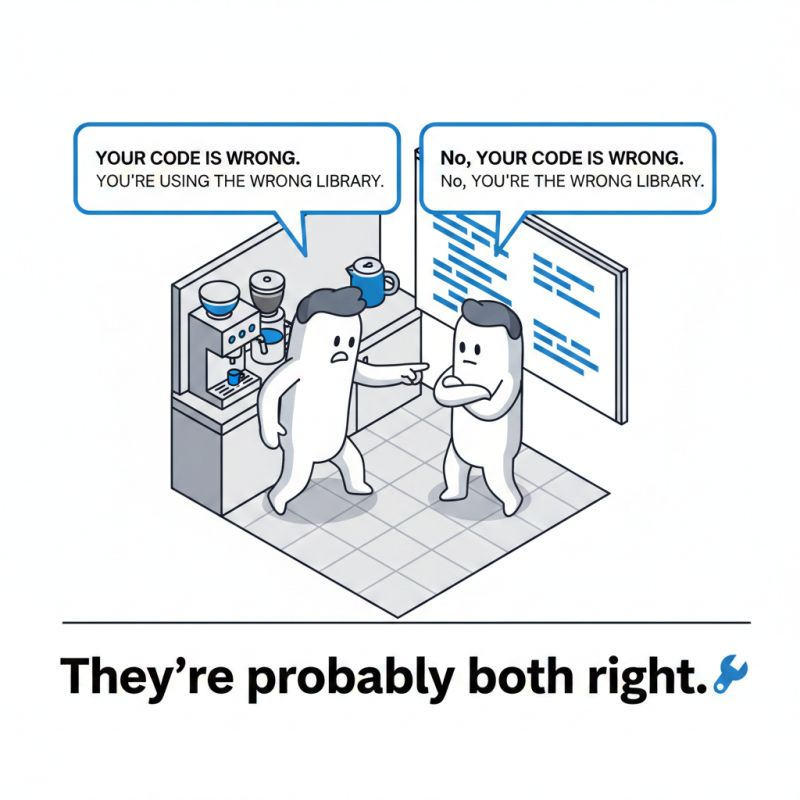

# Two senior devs meet at the coffee machine. 😄

**Date:** 2026-02-17

**Impressions:** 38,779 | **Reactions:** 70 | **Comments:** 90 | **Reposts:** 2

**LinkedIn URL:** [View Post](https://www.linkedin.com/feed/update/urn:li:activity:7429507665682391040)

---

Two senior devs meet at the coffee machine. 😄
"𝘠𝘰𝘶𝘳 𝘤𝘰𝘥𝘦 𝘪𝘴 𝘸𝘳𝘰𝘯𝘨." 
"𝘕𝘰, 𝘠𝘖𝘞𝘙 𝘤𝘰𝘥𝘦 𝘪𝘴 𝘸𝘳𝘰𝘯𝘨." 
"𝘠𝘰𝘶'𝘳𝘦 𝘶𝘴𝘪𝘯𝘨 𝘵𝘩𝘦 𝘸𝘳𝘰𝘯𝘨 𝘭𝘪𝘣𝘳𝘢𝘳𝘺." 
"𝘕𝘰, 𝘠𝘖𝘞'𝘙𝘌 𝘶𝘴𝘪𝘯𝘨 𝘵𝘩𝘦 𝘸𝘳𝘰𝘯𝘨 𝘭𝘪𝘣𝘳𝘢𝘳𝘺."

They’re probably both right — and that’s the funny part. 
Each one writes maintainable code, they just see "quality" through their own lens, instead of zooming out a bit.

𝗙𝗿𝗼𝗺 𝗮 𝗯𝘂𝘀𝗶𝗻𝗲𝘀𝘀 𝗽𝗲𝗿𝘀𝗽𝗲𝗰𝘁𝗶𝘃𝗲, 𝗰𝗼𝗱𝗲 𝗾𝘂𝗮𝗹𝗶𝘁𝘆 𝗶𝘀 𝘀𝘂𝗿𝗽𝗿𝗶𝘀𝗶𝗻𝗴𝗹𝘆 𝘀𝗶𝗺𝗽𝗹𝗲: 𝗶𝘁 𝘀𝗼𝗹𝘃𝗲𝘀 𝘁𝗵𝗲 𝗽𝗿𝗼𝗯𝗹𝗲𝗺 𝗻𝗼𝘄, 𝗮𝗻𝗱 𝗶𝘁 𝗰𝗮𝗻 𝗯𝗲 𝗰𝗵𝗮𝗻𝗴𝗲𝗱 𝘄𝗵𝗲𝗻 𝗿𝗲𝗾𝘂𝗶𝗿𝗲𝗺𝗲𝗻𝘁𝘀 𝘀𝗵𝗶𝗳𝘁. 
That’s it. 
If both approaches check these boxes — the rest might just be a matter of taste. 🔧

Our attachment to SOLID, DRY and other buzzwords is just how we make code both work now and stay maintainable in the future. I say this as someone who wrote code for years until one day I unexpectedly became a CTO and had to learn business thinking.

What’s important is that from this point of view, 𝗱𝗲𝗯𝗮𝘁𝗲𝘀 𝗮𝗯𝗼𝘂𝘁 𝘄𝗵𝗲𝘁𝗵𝗲𝗿 𝗔𝗜 𝘄𝗿𝗶𝘁𝗲𝘀 𝗴𝗼𝗼𝗱 𝗼𝗿 𝗯𝗮𝗱 𝗰𝗼𝗱𝗲 𝗮𝗿𝗲 𝘀𝗲𝗻𝘀𝗲𝗹𝗲𝘀𝘀. 

𝗜𝗳 𝗔𝗜 𝗰𝗼𝗱𝗲 𝘄𝗼𝗿𝗸𝘀 𝗮𝗻𝗱 𝗰𝗮𝗻 𝗯𝗲 𝗿𝗲𝗮𝘀𝗼𝗻𝗮𝗯𝗹𝘆 𝗺𝗼𝗱𝗶𝗳𝗶𝗲𝗱 𝗹𝗮𝘁𝗲𝗿 𝗯𝘆 𝗔𝗜 — 𝗺𝗮𝘆𝗯𝗲 𝗶𝘁’𝘀 𝗻𝗼𝘁 𝗮𝘀 𝗯𝗮𝗱 𝗮𝘀 𝘄𝗲 𝗲𝗻𝗴𝗶𝗻𝗲𝗲𝗿𝘀 𝘁𝗵𝗶𝗻𝗸?

