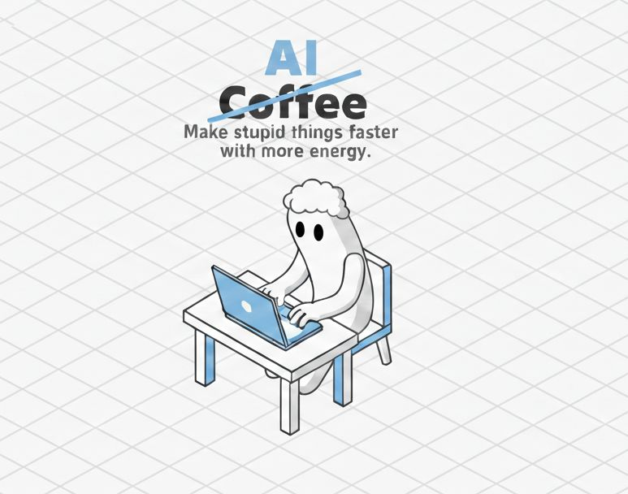

# AI Doesn’t argue with your bad ideas. Whether you’re a startup foun...

**Date:** 2026-02-24

**Impressions:** 2,486 | **Reactions:** 15 | **Comments:** 0 | **Reposts:** 0

**LinkedIn URL:** [View Post](https://www.linkedin.com/feed/update/urn:li:activity:7432043122894761984)

---

𝗔𝗜 𝗗𝗼𝗲𝘀𝗻’𝘁 𝗮𝗿𝗴𝘂𝗲 𝘄𝗶𝘁𝗵 𝘆𝗼𝘂𝗿 𝗯𝗮𝗱 𝗶𝗱𝗲𝗮𝘀. Whether you’re a startup founder, a product owner, or anyone pushing something to market — 𝗶𝘁 𝗷𝘂𝘀𝘁 𝗯𝘂𝗶𝗹𝗱𝘀 𝘆𝗼𝘂𝗿 𝗯𝗮𝗱 𝗶𝗱𝗲𝗮𝘀 𝗳𝗮𝘀𝘁𝗲𝗿. 🤷

AI is great at executing what you describe, but it won’t question whether you described something useful. 
You say "build this feature" — it builds. 
𝗔𝗜 𝗶𝘀𝗻’𝘁 𝗱𝗲𝘀𝗶𝗴𝗻𝗲𝗱 𝘁𝗼 𝗱𝗲𝗳𝗶𝗻𝗲 𝘄𝗵𝗮𝘁 𝘁𝗼 𝗱𝗲𝗹𝗶𝘃𝗲𝗿 — 𝘁𝗵𝗮𝘁’𝘀 𝗼𝗻 𝘂𝘀.

❗𝗧𝗵𝗲 𝗺𝗶𝘀𝘀𝗶𝗻𝗴 𝗽𝗶𝗲𝗰𝗲 𝗶𝘀 𝗳𝗲𝗲𝗱𝗯𝗮𝗰𝗸. This is the chronic pain of anyone trying to push a product to market — we don’t set up that feedback loop from the first steps, so we’re flying blind, not knowing if our actions lead to the result we need.

I remember one of my clients: ReSelf. We spent a year and a half building a mobile app for people struggling with weight, gamified healthy eating. They spent $200K back in 2015, worth significantly more in today’s dollars. Then shut it down within 2 months after release. A year later, another app launches with the same core idea, slightly different execution — and takes off to millions of users. 

Only after I started my own startup I got what the problem was. They organized that feedback loop, adjusting features based on real data instead of guessing.

So what does AI change here? It doesn’t fix this problem. It just lets you do more of the same nonsense, faster. Instead of one unnecessary app for $200K, you can now build three. 🚀

The cycle should be: ship → observe → analyse → change requirements → regenerate. When iteration is cheap, you can afford to be wrong faster — but only if you’re actually measuring whether you’re wrong.

Have you ever built something perfectly — that nobody needed? 👇

